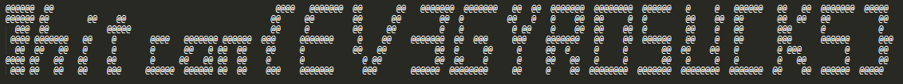

# ev3-scanner
---
**Points:** 180 | **Solves:** 84/1789 | **Category:** Misc

Find the flag.

[Download](ev3scanner-6b325d724565e51b3e2f8e59ff5ee6c9.tar.gz)

Author: Jeffxx

---

[Bahasa Indonesia](#bahasa-indonesia)

## English
In this challenge, given tar files contains an image and a pklg file that can be opened with Wireshark. Image files containing LEGO EV3 using a color sensor are seen to scan the paper containing the flag. While pklg file contains data transmission on RFCOMM protocol. Use filter on wireshark to see the color data sent by LEGO EV3.

```
bluetooth.src == 00:16:53:61:30:c1 && btrfcomm
```

After we apply filter, we can see much packet have data length 9 bytes. So we add filter again for data length = 9.

```
btrfcomm.len == 9
```

After we analyze some packet, we can see different 2-3 last byte. Besides that, there is much value `c0 40` and `80 3f` appear sequentially. We suspect the value is a representation of black and white. In addition to the 2 values above, we consider it as the color obtained when LEGO EV3 comes out of the paper and change direction. So we can extract color data scanned by each row.

using [this script](flag/solve.py) we iterated extracted data, we got output similar with flag. With a little adjustment we got the flag.



Flag: **hitcon{EV3GYROSUCKS}**


## Bahasa Indonesia
Pada challenge ini diberikan sebuah file tar yang berisi sebuah gambar serta file pklg yang dapat dibuka dengan wireshark. File gambar berisi LEGO EV3 dengan menggunakan sensor warna terlihat akan melakukan scan pada kertas yang berisi flag. Sedangkan file pklg ini berisi transmisi data pada protokol RFCOMM. Langsung lakukan filter pada wireshark untuk melihat data warna yang dikirim oleh LEGO EV3.

```
bluetooth.src == 00:16:53:61:30:c1 && btrfcomm
```

Setelah dilakukan filter dapat dilihat ada banyak packet yang memiliki panjang data 9 byte. Tambahkan lagi filter untuk data dengan panjang 9.

```
btrfcomm.len == 9
```

Setelah kami menganalisa kumpulan packet tersebut, terdapat perbedaan byte pada 2-3 byte terakhir. Selain itu, terdapat value `c0 40` dan `80 3f` yang banyak muncul secara berurutan pada packet tersebut. Kami mencurigai value tersebut representasi dari warna hitam dan putih. Selain 2 value diatas, kami menganggapnya sebagai warna yang didapat ketika LEGO EV3 keluar dari kertas dan berbalik arah. Sehingga kita dapat melakukan extraksi data warna yang di scan tiap baris.

Dengan menggunakan [script](flag/solve.py) untuk iterasi data yang telah kami extract, didapatkan sebuah gambar yang mirip flag. dengan sedikit penyesuaian didapatkanlah flag.


Flag: **hitcon{EV3GYROSUCKS}**
