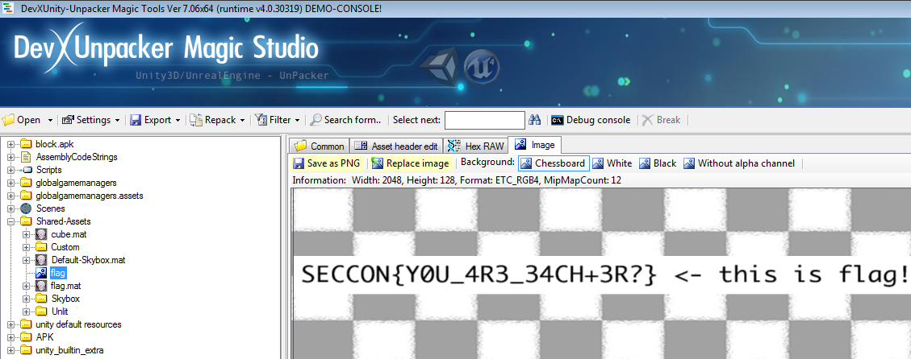

# Block
---
**Points:** 362 | **Solves:** 29/653 | **Category:** Reversing

BREAK THE BLOCK!

Hint: Real answer flag is not easy to get it, if your post flag is incorrect, it is not real one. Please try to analyze more.

[Download](block.apk_f2f0a7d6a3b3e940ca7cd5a3f7c5045eb57f92cf)

---

[Bahasa Indonesia](#bahasa-indonesia)

## English
With some recon, we knew the APK is build with Unity. We used [Unity Unpacker](http://devxdevelopment.com/UnityUnpacker) to analyze this APK and found this interesting asset.

We tried to submit `SECCON{Y0U_4R3_34CH+3R?}` but failed. My friend suggested that the word is *cheater*, and tried to submit `SECCON{Y0U_4R3_CH34+3R?}` but failed again. Then I tried to fix the grammar, and we got the flag!

Flag: `SECCON{4R3_Y0U_CH34+3R?}`

## Bahasa Indonesia
Kami mempelajari bahwa APK dibuat dengan Unity. Kami menggunakan [Unity Unpacker](http://devxdevelopment.com/UnityUnpacker) untuk menganalisa APK ini dan menemukan asset yang menarik.

Kami mencoba submit `SECCON{Y0U_4R3_34CH+3R?}` tetapi gagal. Teman saya memberi ide kalau katanya adalah *cheater* dan mencoba untuk submit `SECCON{Y0U_4R3_CH34+3R?}` tetapi gagal juga. Kemudian saya membetulkan grammar-nya, dan ternyata mendapat flag!

Flag: `SECCON{4R3_Y0U_CH34+3R?}`
